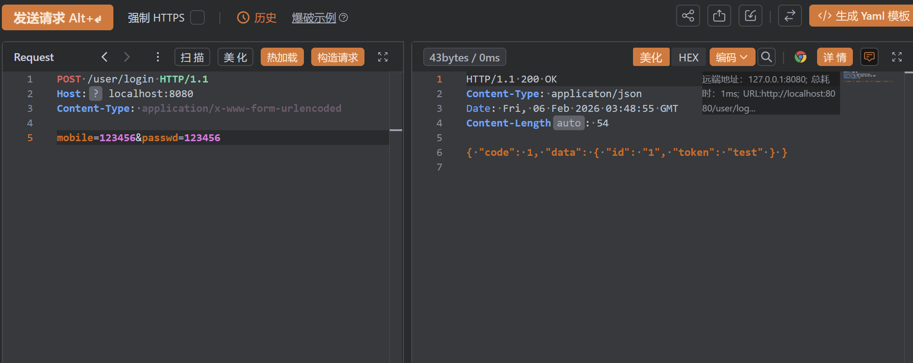

# Go-IM即时通信

## 需求分析
1. 实现功能界面（好友、群聊、我的、发送消息、图片等）
2. 实现资源标准化编码
   - 资源信息采集并标准化。转化成content/url
   - 资源编码，终极目标都是拼接一个消息体（JSON/XML）
3. 确保消息体的可扩展性
   - 兼容基础媒介如图片、文字语音。
   - 能承载大量新业务，扩张不能对现有业务产生影响。
   - 红包/打卡/签到等本质上是消息内容不一样。

## Web HTTP核心API
```go
	// 绑定请求和处理函数
	http.HandleFunc("/user/login", func(writer http.ResponseWriter, request *http.Request) {
		fmt.Fprint(writer, "Hello, World!")
	})
	// 启动web服务器
	http.ListenAndServe(":8080", nil)
```

## 实现后端登录接口
|||
|---|---|
|业务名称|登录|
|请求格式|`/user/login`|
|请求参数|`mobile`：用户手机号 `passwd`：用户密码|
|返回json|{"code":0, "msg":"信息提示", "data":{"id":"用户id", "token":"鉴权因子"}}|

**解析参数**
```go
	// 绑定请求和处理函数
	http.HandleFunc("/user/login", func(writer http.ResponseWriter, request *http.Request) {
		// 解析参数
		err := request.ParseForm()
		if err != nil {
			fmt.Fprint(writer, err)
		}

		mobile := request.PostForm.Get("mobile")
		passwd := request.PostForm.Get("passwd")

		loginOk := false
		if mobile == "123456" && passwd == "123456" {
			loginOk = true
		}

		// 成功json
		str := `{"code":1,"data":{"id":"1","token":"test"}}`
		if !loginOk {
			// 失败json
			str = `{"code":-1,"msg":"密码不正确"}`
		}

		writer.Header().Set("Content-Type", "applicaton/json")
		writer.WriteHeader(http.StatusOK)
		writer.Write([]byte(str))
	})
```
- `request.ParseForm()`：ParseForm 填充 `r.form` 和 `r.PostForm`。对于所有请求，ParseForm 解析 URL 中的原始查询并更新 r.form。对于POST、PUT和PATCH请求，它还读取请求正文，解析为表单，并将结果放入r.PostForm和r.Form中。但函数出错时，返回错误信息。



## 对代码进行优化
```go
package main

import (
	"encoding/json"
	"fmt"
	"log"
	"net/http"
)

// H 响应内容结构体
type H struct {
	Code int
	Msg  string
	Data interface{}
}

func main() {
	// 绑定请求和处理函数
	http.HandleFunc("/user/login", userLogin)
	// 启动web服务器
	http.ListenAndServe(":8080", nil)
}

// userLogin 用户登录请求函数
func userLogin(writer http.ResponseWriter, request *http.Request) {
	// 解析参数
	err := request.ParseForm()
	if err != nil {
		fmt.Fprint(writer, err)
	}

	mobile := request.PostForm.Get("mobile")
	passwd := request.PostForm.Get("passwd")

	loginOk := false
	if mobile == "123456" && passwd == "123456" {
		loginOk = true
	}

	if loginOk {
		data := make(map[string]interface{})
		data["id"] = 1
		data["token"] = "test"

		Resp(writer, 0, data, "")
	} else {
		Resp(writer, -1, nil, "密码不正确")
	}
}

func Resp(w http.ResponseWriter, code int, data interface{}, msg string) {
	w.Header().Set("Content-Type", "applicaton/json")
	w.WriteHeader(http.StatusOK)

	h := H{
		Code: code,
		Msg:  msg,
		Data: data,
	}
	// 将结构体转化为json字符串
	ret, err := json.Marshal(h)
	if err != nil {
		log.Println(err)
	}

	w.Write(ret)

}
```

## 实现页面展示和指定资源支持
知识点：
- `func FileServer(root FileSystem)` 实现静态资源服务
- `template` 模板渲染必备技巧
- `Vue` + `Mui` + `Ajax` + `Promis`

```go
func main() {
	// 绑定请求和处理函数
	http.HandleFunc("/user/login", userLogin)

	// 提供静态资源目录支持
	http.Handle("/asset/", http.FileServer(http.Dir(".")))

	// 启动web服务器
	http.ListenAndServe(":8080", nil)
}
```
- `http.Dir(".")`创建一个以当前目录为根目录的文件系统处理器。
- `http.FileServer()`创建一个HTTP处理器，用于提供指定文件系统的静态文件。
- `http.Handle("/asset/", http.FileServer(http.Dir(".")))`将路径前缀`/asset/`映射到刚创建的文件服务器处理器，当有以/asset/开头的请求时，会转发到这个文件服务器。

## 登录页面渲染
```go
http.HandleFunc("/user/login.shtml", func(w http.ResponseWriter, request *http.Request) {
	tpl, err := template.ParseFiles("view/user/login.html")
	if err != nil {
		log.Fatal(err.Error())
	}
	tpl.ExecuteTemplate(w, "/user/login.shtml", nil)
})
```
- `template.ParseFile()`函数读取目标文件内容，将目标文件内容解析为go模板对象，返回`*template.Template`对象和可能的错误。
- `tpl.ExecuteTemplate(w, "/user/login.shtml", nil)`执行指定的模板，并将结果写入HTTP响应
  - `w` HTTP响应写入器
  - `/user/login.shtml` 模板名称，要执行的模板名称。模板名称!=路径名称
  - `nil` 模板数据，要传递给模板的数据，nil表示无数据

## 注册页面渲染
```go
	http.HandleFunc("/user/register.shtml", func(w http.ResponseWriter, request *http.Request) {
		tpl, err := template.ParseFiles("view/user/register.html")
		if err != nil {
			log.Fatal(err.Error())
		}
		// 渲染模板
		tpl.ExecuteTemplate(w, "/user/register.shtml", nil)
	})
```
与登录界面渲染相同，只需修改模板名称和一些标题内容。

## 简化代码
登录页面渲染和注册页面渲染代码基本相同，只是要解析的文件不同，可以对代码进行优化。
```go
func RegisterView() {
	tpl, err := template.ParseGlob("view/**/*")
	if err != nil {
		log.Fatal(err.Error())
	}

	for _, v := range tpl.Templates() {
		tplname := v.Name()
		http.HandleFunc(tplname, func(writer http.ResponseWriter, request *http.Request) {
			tpl.ExecuteTemplate(writer, tplname, nil)
		})
	}
}
```
- `template.ParseGlob("view/**/*")`：使用通配符模式，递归扫描view目录及其子目录下的模板文件，`**`表示任意层级的子目录。
- `for _, v := range tpl.Templates() `：遍历所有模板，`tpl.Templates()`返回所有已解析的模板。 