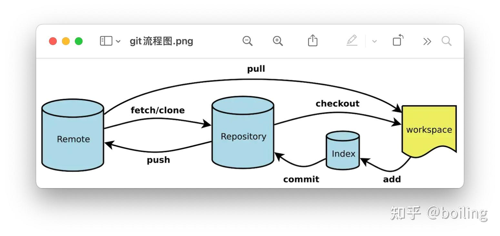

# Git

## 创建版本库
打开终端，在要创建版本库的目录下，执行命令：
`git init`

将需要管理的文件添加到暂存区：
`git add <file>`

也可以使用以下命令一次性将所有变更添加到暂存区：
`git add .`

提交暂存区的变更到本地仓库，并添加描述信息：
`git commit -m "Initial commit"`

现在已经成功创建了一个版本库。可以使用其他git命令管理它：
- `git status`：查看当前工作区和暂存区的状态
- `git log`：查看提交记录
- `git branch`：管理分支
- `git remote`：管理远程仓库

## 版本回退
要将Git存储库版本回退，请使用git reset命令。如果您想要撤销上次提交并返回到上一个提交，则可以使用以下命令：
`git reset HEAD~1`
这将使HEAD指向上一个提交，但不会删除您最新的更改。如果您希望完全返回到以前的提交并放弃所有更改，则可以添加--hard选项：
`git reset --hard HEAD~1`
此操作将永久删除您最新的更改，请谨慎使用。如果您已经将更改推送到远程存储库，则在执行此操作之前应先备份这些更改。