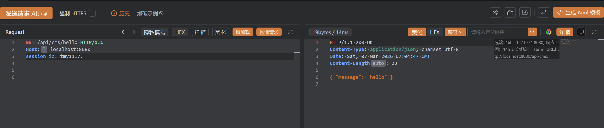
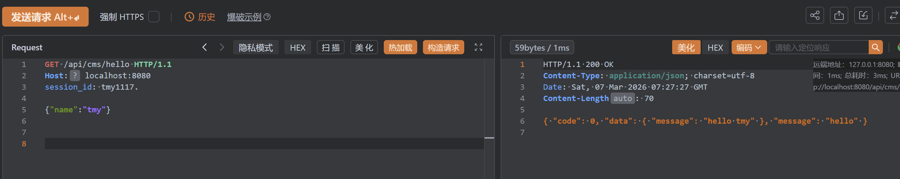
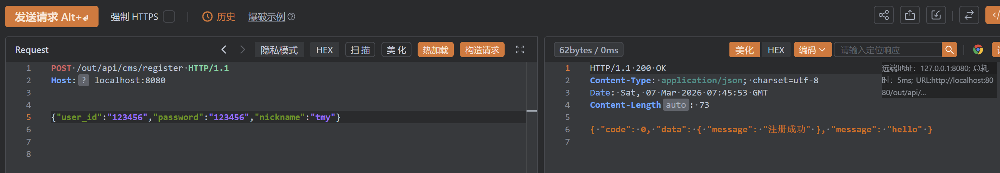
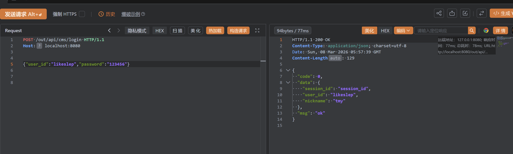

# Go工程实践
基于GO生态，构建一个支持**内容管理，内容加工，内容分发**的内容库系统。

## 技术选型
- Gin 
- Go
- go-redis
- gorm
- Redis、MySQL
- goflow 

## 目录结构
- cmd（工程入口）
  - main.exe
- internal（内部逻辑）
  - dao（操作存储资源）
  - model（model工程）
  - service（逻辑服务）
  - utils（工具、方法）
  - config（配置文件）
  - cache
- pkg（外部包）
  


## Gin快速入门
```go
func main() {
	router := gin.Default()
	router.GET("/ping", func(c *gin.Context) {
		c.JSON(200, gin.H{
			"message": "pong",
		})
	})
	err := router.Run() // 默认监听 0.0.0.0:8080
	if err != nil {
		fmt.Printf("r run error = %v", err)
		return
	}
}
```
1. `router := gin.Default()`
   - 创建一个引擎实例，返回一个`*gin.Engine`类型，Engine是Gin框架的核心结构体。它负责管理所有路由规则、中间件、配置以及如何启动一个HTTP服务。它创建出来的引擎类型默认带两个中间件（**Logger和Recovery**）。我们可以使用`gin.New()`来创建一个没有任何中间件的引擎。
2. `r.GET(relativePath string, handlers ...HandlerFunc)`
   - 注册路由
   - 用于注册一个HTTP GET请求的路由
   - 参数1：路由的路径，这里是`/ping`
   - 参数2：一个可变参数，可以传入一个或多个处理函数。当请求路径匹配时，这些函数会依次被执行
3. `gin.Context`
   - Context是Gin中最重要、最常用的一个结构体，它承载一个HTTP请求从开始到结束的所有信息。
   - 可以把它看作一个请求的快递包裹，既有请求的内容，也有回复的接口。
   - 主要作用：
     - 获取请求数据，例如：`c.Query("name")`、`c.PostForm("age")`、`c.Param("id")`、`c.ShouldBindJSON(&struct)`
     - 设置和读取上下文共享数据
     - 返回响应数据，例如：`c.JSON()` `c.String()` `c.HTML()` `c.XML()` `c.File()`
4. `c.JSON(code int, obj any)`
   - 向客户端返回要给JSON格式的响应
   - code：HTTP状态码
   - obj：想返回给客户端的数据，Gin会把这个数据自动序列化为JSON字符串
5. `gin.H`
   - 实际上是个`map[string]any`的类型别名，any实际上是个interface{}空接口。
   - 它是一个快捷方式，用于快速构建一个简单的JSON数据结构，而不需要预先定义结构体。
6. `r.Run()`
   - 启动服务，如果不传入参数，默认是本地的8080端口。


## Gin路由定义

**API层 - 路由注册**
```go
package api

import (
	"ContentSystem/internal/service"
	"github.com/gin-gonic/gin"
)

const (
	rootPath = "/api/"
)

// CmsRouters 管理所有cms路由
func CmsRouters(r *gin.Engine) {
	root := r.Group(rootPath)

	cmsApp := service.NewCmsApp()

	// /api/cms/hello
	root.GET("/cms/hello", cmsApp.Hello)
}
```
- router.go文件负责集中管理所有的路由。

**CmsApp结构体定义**
```go
package service

type CmsApp struct{}

func NewCmsApp() *CmsApp {
	return &CmsApp{}
}
```
1. 定义CmsApp结构体和相关创建函数
2. 面向对象设计，将cms相关的所有方法都挂在到CmsApp这个结构体上

**具体的业务逻辑处理**
```go
package service

import (
	"github.com/gin-gonic/gin"
	"net/http"
)

func (cms *CmsApp) Hello(c *gin.Context) {
	c.JSON(http.StatusOK, gin.H{
		"message": "ok",
	})
}
```
1. 这个文件实现了CMS服务的具体业务方法
2. 只负责处理业务逻辑，不关心路由是怎么注册的


**main函数调用**
```go
package main

import (
	"awesomeProject/internal/api"
	"fmt"
	"github.com/gin-gonic/gin"
)

func main() {
	router := gin.Default()
	api.CmsRouter(router)

	err := router.Run() // 默认监听 0.0.0.0:8080
	if err != nil {
		fmt.Printf("r run error = %v", err)
		return
	}
}
```

## 中间件
一种用于处理HTTP请求和响应的模块。中间件函数位于请求处理程序和路由之间，可以在请求被处理之前或之后执行一些额外的操作。

以下是一个基于Header的会话认证中间件，用于保护需要登录才能访问的API
```go
const (
	SessionKey = "session_id"
)

type SessionAuth struct {
}

func (s *SessionAuth) Auth(ctx *gin.Context) {
	sessionID := ctx.GetHeader(SessionKey)
	// TODO : imp auth 
	if sessionID == "" {
		ctx.AbortWithStatusJSON(http.StatusForbidden, "session_id is null")
	} else {
		fmt.Println("session_id is ", sessionID)
	}
	ctx.Next()
}
```
1. `ctx.GetHeader(SessionKey)`：从请求头中获取名为 session_id 的值。
2. `ctx.AbortWithStatusJSON(code int, obj any)`：终止后续所有处理函数执行，并立即返回JSON响应。
   - 调用后，后续的中间件和最终处理函数都不会执行，相当于：
     - `c.JSON(http.StatusForbidden, "session id is null")  c.Abort()//终止后续处理`
3. `c.Next()`：继续执行下一个中间件或最终的路由处理函数，调用时机：只有在认证通过时才应该调用。

```go
	// 注册鉴权中间件
	session := &SessionAuth{}

	root := r.Group(rootPath).Use(session.Auth)
```
使用`Use()`方法将中间件注册到组中，在这个组下的api接口都需要经过鉴权。




## 模型绑定与验证
模型绑定和验证是一种处理HTTP请求数据和验证输入的功能。模型绑定指的是将请求中的数据自动绑定到Go结构体中。当收到一个包含表单数据、JSON数据或查询字符串的HTTP请求时，Gin可以自动将这些数据解析并绑定到目标结构体中的字段。

```go
type HelloReq struct {
	Name string `json:"name" binding:"required"`
}

type HelloRsp struct {
	Message string `json:"message" binding:"required"`
}

func (cms *CmsApp) Hello(c *gin.Context) {
	var req HelloReq
	if err := c.ShouldBindJSON(&req); err != nil {
		c.JSON(http.StatusBadRequest, gin.H{"error": err.Error()})
		return
	}
	c.JSON(http.StatusOK, gin.H{
		"code":    0,
		"message": "hello",
		"data": &HelloRsp{
			Message: fmt.Sprintf("hello %s", req.Name),
		},
	})
}
```
1. Struct Tags解析
   - `json:"name"`：指定JSON序列化和反序列化的字段名
   - `binding:"required"`：验证规则：该字段不能为空
     - 对于字符串，不能是空字符串""
     - 对于数字，不能为0
     - 对于切片/数组/map，不能是nil
     - 对于指针，不能是nil
     - 对于结构体，不能是零值
2. `c.ShouldBindJSON()`：将HTTP请求的JSON主体解析并绑定到指定的GO结构体，同时执行数据验证。



模型设计的好处：
- 请求模型：明确客户端需要提供什么
- 响应模型：明确服务端会返回什么
这种方式相当于API契约，让前后端对接更加清晰。

## 用户注册
初始化接口：`/out/api/cms/register`

```go
const noAuthPath = "/out/api/"

// 用户注册
noAuth := r.Group(noAuthPath)
{
	noAuth.POST("/cms/register", cmsApp.Register)
}
```

用户注册处理函数
```go
package service

import (
	"fmt"
	"github.com/gin-gonic/gin"
	"net/http"
)

type RegisterReq struct {
	UserID   string `json:"user_id" binding:"required"`
	Password string `json:"password" binding:"required"`
	Nickname string `json:"nickname" binding:"required"`
}

type RegisterRsp struct {
	Message string `json:"message" binding:"required"`
}

func (cms *CmsApp) Register(c *gin.Context) {
	var req RegisterReq
	if err := c.ShouldBindJSON(&req); err != nil {
		c.JSON(http.StatusBadRequest, gin.H{"error": err.Error()})
		return
	}

	// TODO: 密码加密
	// TODO: 账号校验（账号是否存在）
	// TODO: 账号信息持久化

	fmt.Println("register = ", req)
	c.JSON(http.StatusOK, gin.H{
		"code":    0,
		"message": "hello",
		"data": &RegisterRsp{
			Message: fmt.Sprintf("注册成功"),
		},
	})
}
```




## 密码加密
使用`bcrypt.GenerateFromPassword()`方法对原始密码进行加密生成密码哈希。
- 自动生成一个随机盐值
- 使用选择的工作因子（或称计算机成本）和盐值，在内部进行多次迭代的哈希计算
- 计算哈希

```go
// encryptPassword 注册的密码进行加密
func encryptPassword(password string) (string, error) {
	hashedPassword, err := bcrypt.GenerateFromPassword([]byte(password), bcrypt.DefaultCost)
	if err != nil {
		fmt.Printf("bcrypt generate from password error = %v", err)
		return "", err
	}
	return string(hashedPassword), nil
}
```

## GORM快速入门
GORM是Go语言中的一个流行的ORM（对象关系映射）库。它提供了简单而强大的方式来处理数据库操作，使得开发者可以更轻松地与数据库进行交互。
- 链式方法调用
- 自动映射
- 数据校验
- 事务支持

快速入门：
```go
package main

import (
	"fmt"
	"gorm.io/driver/mysql"
	"gorm.io/gorm"
	"time"
)

type Account struct {
	ID       int64     `gorm:"column:id;primary_key"`
	UserID   string    `gorm:"column:user_id"`
	Password string    `gorm:"column:password"`
	Nickname string    `gorm:"column:nickname"`
	Ct       time.Time `gorm:"column:created_at"`
	Ut       time.Time `gorm:"column:update_at"`
}

/*
func (a Account) TableName() string {
	return "account"
}
*/

func main() {
	db := connDB()
	var accounts []Account
	if err := db.Table("account").Find(&accounts).Error; err != nil {
		fmt.Println(err)
		return
	}
	fmt.Println(accounts)
	
}

func connDB() *gorm.DB {
	mysqlDB, err := gorm.Open(mysql.Open("root:123456@tcp(localhost:3306)/cms_account?charset=utf8mb4&parseTime=True&loc=Local"))
	if err != nil {
		panic(err)
	}

	db, err := mysqlDB.DB()
	if err != nil {
		panic(err)
	}

	db.SetMaxOpenConns(4)
	db.SetMaxIdleConns(2)

	mysqlDB = mysqlDB.Debug()
	return mysqlDB
}
```
1. 结构体标签：
   - `column:user_id`：指定该字段对应的数据库列名为`user_id`
   - `primary_key`：告诉gorm，ID字段是主键
2. `func (a Account) TableName() string {}`：是对TableName方法的重写。默认情况下，gorm会把结构体名字转换成复数（例如Account转化成accounts）作为表名。如果对TableName方法进行重写，gorm会指向你定义的表名。
3. `gorm.Open(mysql.Open("root:123456@tcp(localhost:3306)/cms_account?charset=utf8mb4&parseTime=True&loc=Local"))`
   - 连接mysql数据库
   - `charset=utf8mb4`：指定字符集
   - `parseTime=True`：告诉MySQL驱动将数据库中的DATE和DATETIME类型自动解析为Go的time.Time类型
   - `log=Local`：设置时区
4. 连接池配置
   - `db, err := mysqlDB.DB()`：获取底层的`sql.DB`对象，从而配置链接池。
   - `SetMaxOpenConns`：设置最大打开连接数
   - `SetMaxIdleConns`：设置最大空闲连接数
   - `mysqlDB = mysqlDB.Debug()`：让gorm在控制台打印出它最终执行的SQL语句
5. 数据查询
   - `Find(&accounts)`：执行`SELECT * FROM account`语句，将查询结果扫描并填充到accounts切片中。传入切片的指针是必须的。


## 数据持久化
将注册的用户信息写入数据库。

将连接数据库的操作写入cms.go中，并在CmsApp结构体中加入gorm.DB属性。
```go
package service

import (
	"gorm.io/driver/mysql"
	"gorm.io/gorm"
)

type CmsApp struct {
	db *gorm.DB
}

func NewCmsApp() *CmsApp {
	app := &CmsApp{}
	connDB(app)
	return app
}

func connDB(app *CmsApp) {
	var err error
	app.db, err = gorm.Open(mysql.Open("root:123456@tcp(localhost:3306)/?charset=utf8mb4&parseTime=True&loc=Local"))
	if err != nil {
		panic(err)
	}

	db, err := app.db.DB()
	if err != nil {
		panic(err)
	}

	db.SetMaxOpenConns(4)
	db.SetMaxIdleConns(2)

}
```
- `mysql.Open("root:123456@tcp(localhost:3306)/?charset=utf8mb4&parseTime=True&loc=Local")`
  - 对这里进行了更改，因为系统可能会调多个数据库，总不能为每个数据库进行连接。这里将数据库名的位置省略。

在model目录下加入用户的结构体
```go
type Account struct {
	ID       int64     `gorm:"column:id;primary_key"`
	UserID   string    `gorm:"column:user_id"`
	Password string    `gorm:"column:password"`
	Nickname string    `gorm:"column:nickname"`
	Ct       time.Time `gorm:"column:created_at"`
	Ut       time.Time `gorm:"column:update_at"`
}

func (a Account) TableName() string {
	return "cms_account.account"
}
```
- `return "cms_account.account"`：这里在表名前加入数据库名，遇上一个操作进行联动。

dao目录下放的是Go对数据库的操作。

```go
package dao

import (
	"ContentSystem/internal/model"
	"fmt"
	"gorm.io/gorm"
)

type AccountDao struct {
	db *gorm.DB
}

func NewAccountDao(db *gorm.DB) *AccountDao {
	return &AccountDao{db: db}
}

// isExit 判断账号是否存在
func (a *AccountDao) IsExit(userID string) (bool, error) {
	var account model.Account
	err := a.db.Where("user_id = ?", userID).First(&account).Error
	if err == gorm.ErrRecordNotFound {
		return false, nil
	}
	if err != nil {
		fmt.Printf("AccountDao isExit = [%v]", err)
		return false, err
	}

	return true, nil
}

// Create 将数据写入数据库
func (a *AccountDao) Create(account model.Account) error {
	if err := a.db.Create(&account).Error; err != nil {
		fmt.Printf("AccountDao Create = [%v]", err)
		return err
	}
	return nil
}
```

在register处理函数中，加上我们预留的账号校验部分和存入信息部分。
```go
//账号校验（账号是否存在）
accountDao := dao.NewAccountDao(cms.db)
isExit, err := accountDao.IsExit(req.UserID)
if err != nil {
	c.AbortWithStatusJSON(http.StatusInternalServerError, gin.H{"error": err.Error()})
	return
}
if isExit {
	c.JSON(http.StatusBadRequest, gin.H{"error": "账号已存在"})
	return
}

//账号信息持久化
nowTime := time.Now()
if err := accountDao.Create(model.Account{
	UserID:   req.UserID,
	Password: hashedPassword,
	Nickname: req.Nickname,
	Ct:       nowTime,
	Ut:       nowTime,
}); err != nil {
	c.AbortWithStatusJSON(http.StatusInternalServerError, gin.H{"error": err.Error()})
	return
}
```

## 用户登入

创建用户登录的处理函数
- login_handle.go
```go
package service

import (
	"ContentSystem/internal/dao"
	"github.com/gin-gonic/gin"
	"golang.org/x/crypto/bcrypt"
	"net/http"
)

type LoginReq struct {
	UserID   string `json:"user_id" binding:"required"`
	Password string `json:"password" binding:"required"`
}

type LoginRsp struct {
	SessionID string `json:"session_id"`
	UserID    string `json:"user_id"`
	Nickname  string `json:"nickname"`
}

func (cms *CmsApp) Login(c *gin.Context) {
	var req LoginReq
	if err := c.ShouldBindJSON(&req); err != nil {
		c.JSON(http.StatusBadRequest, gin.H{"error": err.Error()})
		return
	}

	accountDao := dao.NewAccountDao(cms.db)
	account, err := accountDao.FirstByUserID(req.UserID)
	if err != nil {
		c.JSON(http.StatusBadRequest, gin.H{
			"error": "请输入正确的账号ID",
		})
	}

	err = bcrypt.CompareHashAndPassword([]byte(account.Password), []byte(req.Password))
	if err != nil {
		c.JSON(http.StatusBadRequest, gin.H{"error": "请输入正确的密码"})
	}

	sessionID := generateSessionID()
	c.JSON(http.StatusOK, gin.H{
		"code": 0,
		"msg":  "ok",
		"data": &LoginRsp{
			SessionID: sessionID,
			UserID:    account.UserID,
			Nickname:  account.Nickname,
		},
	})

}

func generateSessionID() string {
	// TODO : session id 生成
	// TODO : session id 持久化
	return "session_id"
}

```

dao文件加入用户查找方法
```go
// FirstByUserID 用户登录时判断用户的账户是否存在
func (a *AccountDao) FirstByUserID(userID string) (*model.Account, error) {
	var account model.Account
	if err := a.db.Where("user_id = ?", userID).First(&account).Error; err != nil {
		fmt.Printf("FirstByUserID error = [%v]\n", err)
		return nil, err
	}
	return &account, nil
}
```




## go-redis

Redis客户端连接
```go
func connRdb() *redis.Client {
	rdb := redis.NewClient(&redis.Options{
		Addr:     "localhost:6379",
		Password: "",
		DB:       0,
	})
	_, err := rdb.Ping(context.Background()).Result()
	if err != nil {
		panic(err)
	}
	return rdb
}
```
1. `redis.NewClient()`：创建客户端
   - 参数`redis.Options{}`结构体，配置连接信息
   - `Addr`：Redis服务器地址，默认是localhost:6379
   - `Password`：连接密码，如果Redis设置了密码需要填写
   - `DB`：选择的数据库编号，Redis默认有16个数据库

2. `Ping()`：发送PING命令测试与Redis服务器的联通性
3. `context.Background()`：返回一个空的Context。这个空Context通常作为所有Context的根节点或起点。

```go
func main() {
	rdb := connRdb()
	ctx := context.Background()
	err := rdb.Set(ctx, "session_id:admin", "session_id", 5*time.Second).Err()
	if err != nil {
		panic(err)
	}

	sessionID, err := rdb.Get(ctx, "session_id:admin").Result()
	if err != nil {
		panic(err)
	}
	fmt.Println(sessionID)
}
```


## session持久化和鉴权

当用户登录时，会产生一个session_id来维持用户的状态。

生成session_id函数
```go
func (c *CmsApp) generateSessionID(ctx context.Context, userID string) (string, error) {
	// session id 生成
	sessionID := uuid.New().String()

	// session id 持久化
	sessionKey := utils.GetSessionKey(userID)
	err := c.rdb.Set(ctx, sessionKey, sessionID, time.Hour*8).Err()
	if err != nil {
		fmt.Printf("rdb set error = %v \n", err)
		return "", err
	}

	authKey := utils.GetAuthKey(sessionID)
	err = c.rdb.Set(ctx, authKey, time.Now().Unix(), time.Minute).Err()
	if err != nil {
		fmt.Printf("rdb set error = %v \n", err)
		return "", err
	}

	return sessionID, nil
}
```
我们讲session_id生成后存放在redis库中。session_id需要高频读写，无需永久保存的数据，所以不需要保存在MySQL数据库中。Redis是一种基于内存的数据库，数据主要存储在RAM中，读写速度快，支持高并发。MySQL主要是基于磁盘的数据库。Redis原生支持过期，当用户登录后，session会在一定事件后自动失效，Redis提供了非常完美的键过期功能。
1. `uuid.New().String()`：生成一个sessionID。 
2. `c.rdb.Set(ctx, sessionKey, sessionID, time.Hour*8)`：将键值对存入Redis数据库中，并设置过期时间，在8小时后会自动销毁。
3. `authKey`：是为了后续鉴权使用。

连接Redis数据库
```go
func connRdb(app *CmsApp) {
	app.rdb = redis.NewClient(&redis.Options{
		Addr:     "localhost:6379",
		Password: "",
		DB:       0,
	})
	_, err := app.rdb.Ping(context.Background()).Result()
	if err != nil {
		panic(err)
	}
}
```

**session鉴权**，当用户访问时，后端根据用户的请求头中的session_id的值，来查找数据库中AuthKey的键值时候还有效，当AuthKey已经过期失效时，就需要用户去重新登录。我们对之前的认证中间价进行补充。

```go
const SessionKey = "session_id"

type SessionAuth struct {
	rdb *redis.Client
}

func NewSessionAuth() *SessionAuth {
	s := &SessionAuth{}
	connRdb(s)
	return s
}

func (s *SessionAuth) Auth(c *gin.Context) {
	sessionID := c.GetHeader(SessionKey)
	if sessionID == "" {
		c.AbortWithStatusJSON(http.StatusForbidden, "session id is null")
	}
	authKey := utils.GetAuthKey(sessionID)
	loginTime, err := s.rdb.Get(c, authKey).Result()
	if err != nil && err != redis.Nil {
		c.AbortWithStatusJSON(http.StatusInternalServerError, "session auth error")
	}
	if loginTime == "" {
		c.AbortWithStatusJSON(http.StatusUnauthorized, "session auth fail")
	}

	c.Next()
}

func connRdb(s *SessionAuth) {
	s.rdb = redis.NewClient(&redis.Options{
		Addr:     "localhost:6379",
		Password: "",
		DB:       0,
	})
	_, err := s.rdb.Ping(context.Background()).Result()
	if err != nil {
		panic(err)
	}
}
```
1. 这里我们又对Redis进行了连接，用于从数据库中获取AuthKey。
2. 我们从请求头中获取session_id的值，如果session_id为空，则不能进行后续的访问。
3. 根据用户的session_id，我们去找对应的AuthKey的值，如果值为空，说明session已经过期，需要去重新登录。

## 内容库
